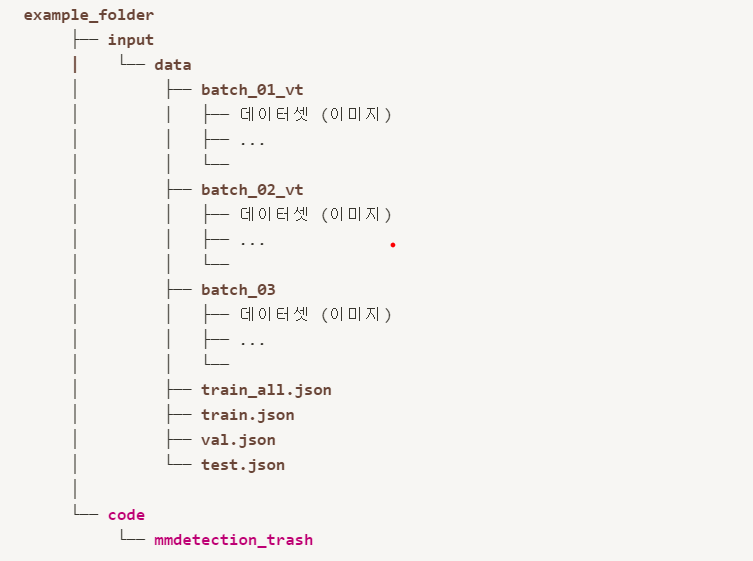
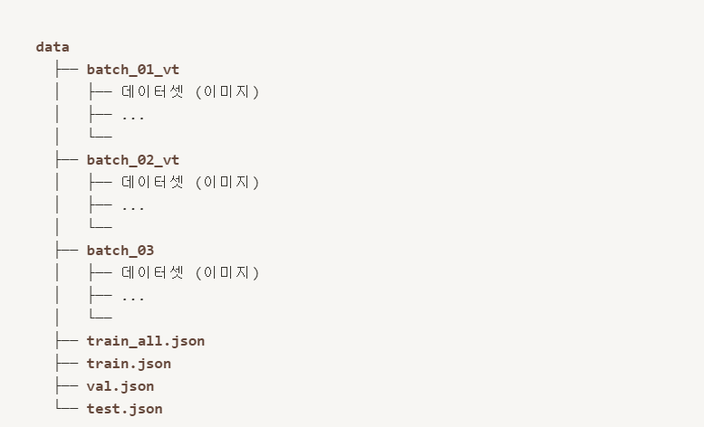
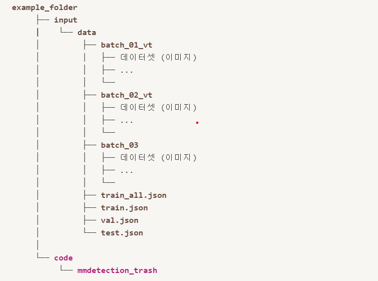
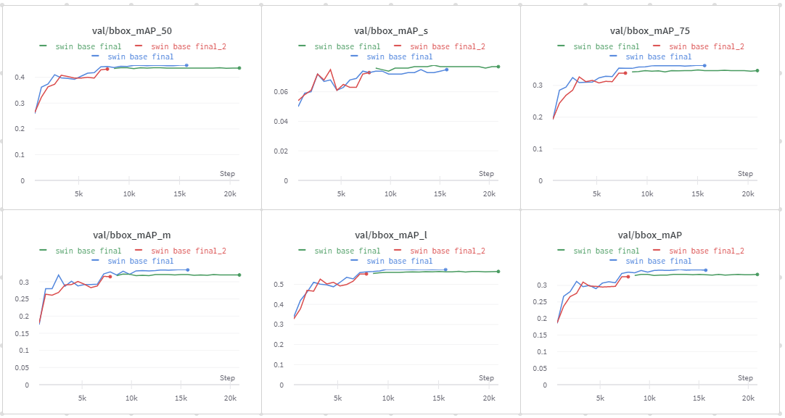

# Ai tech boostcamp
# P-stage 3-2 (object detection)
# 재활용 품목 분류를 위한 Object Detection


## Directory

```
mmdetection_trash
├── README.md
├── box_fusion\ (3).ipynb
├── configs
│   ├── _base_
│   │   ├── datasets
│   │   │   └── dataset_swin_final.py
│   │   ├── default_runtime.py
│   │   ├── default_runtime_swin_base_final.py
│   │   ├── default_runtime_swin_base_final_2.py
│   │   ├── models
│   │   │   ├── cascade_mask_rcnn_swin_fpn.py
│   │   │   ├── faster_rcnn_r50_fpn.py
│   │   │   └── ssd300.py
│   │   └── schedules
│   │       ├── schedule_1x.py
│   │       └── schedule_2x.py
│   ├── faster_rcnn
│   │   └── faster_rcnn_r50_fpn_1x_coco.py
│   ├── ssd
│   │   ├── README.md
│   │   ├── ssd300_coco.py
│   │   └── ssd512_coco.py
│   ├── swin
│   │   ├── cascade_mask_rcnn_swin_base_patch4_window7_mstrain_480-800_giou_4conv1f_adamw_3x_coco.py
│   │   ├── cascade_mask_rcnn_swin_small_patch4_window7_mstrain_480-800_giou_4conv1f_adamw_3x_coco.py
│   │   ├── mask_rcnn_swin_small_patch4_window7_mstrain_480-800_adamw_3x_coco.py
│   │   └── mask_rcnn_swin_tiny_patch4_window7_mstrain_480-800_adamw_1x_coco.py
│   ├── trash
│   │   ├── dataset.py
│   │   ├── dataset_hybrid.py
│   │   ├── faster_rcnn
│   │   │   ├── faster_rcnn_r50_bifpn_1x_trash.py
│   │   │   └── faster_rcnn_r50_fpn_1x_trash.py
│   │   ├── ssd
│   │   │   └── ssd300_trash.py
│   │   ├── swin
│   │   │   ├── cascade_mask_rcnn_swin_base_patch4_3x_final.py
│   │   │   ├── cascade_mask_rcnn_swin_base_patch4_3x_final_2.py
│   │   │   ├── cascade_mask_rcnn_swin_base_patch4_window7_mstrain_480-800_giou_4conv1f_adamw_3x_coco.py
│   │   │   ├── cascade_mask_rcnn_swin_small_patch4_window7_mstrain_480-800_giou_4conv1f_adamw_3x_coco.py
│   │   │   ├── hybrid_cascade.py
│   │   │   └── mask_rcnn_swin_tiny_patch4_window7_mstrain_480-800_adamw_1x_coco.py
│   │   └── yolo
│   │       └── yolov3_d53_mstrain-608_273e_trash.py
│   └── yolo
│       ├── README.md
│       ├── yolov3_d53_320_273e_coco.py
│       ├── yolov3_d53_mstrain-416_273e_coco.py
│       └── yolov3_d53_mstrain-608_273e_coco.py
├── docs
│   ├── P-stage3\ obd\ ?\234?\221\234?\232?.pdf
│   └── pstage3\ obd\ ?\236??\227\205_2.pdf
├── img_7.png
├── img_8.png
├── imgs
│   ├── img.png
│   ├── img_1.png
│   ├── img_2.png
│   ├── img_5.png
│   ├── img_6.png
│   ├── img_7.png
│   └── img_8.png
├── make_coco_object_alone_4.ipynb
├── mmdet
│   └── models
│       └── necks
│           ├── __init__.py
│           └── bifpn.py
├── pkl_to_subhtc.py
├── pkl_to_submission.py
├── setup.py
├── test\ history.html
└── tools
    ├── test.py
    └── train.py
```

### How to install?
1. 데이터 다운로드
    * data 구성
    
      
2. 라이브러리 설치
    * 아래의 경로를 확인하여 코드 합축을 푼 후 `code` 폴더를 아래와 같은 위치에 구성해주세요.
    
      
    * `mmdetection_trash`로 들어가서 아래 명령어를 실행해 필요한 라이브러리를 설치해 줍니다.
    
    ```shell
    conda install pytorch=1.6.0 cudatoolkit=10.1 torchvision -c pytorch
    
    pip install mmcv-full -f <https://download.openmmlab.com/mmcv/dist/cu101/torch1.6.0/index.html>
    
    pip install -r requirements.txt
    
    pip install -v -e .
    ```

### 베이스라인 코드 설명
#### train
1. terminal 에서 mmdetection_trash folder로 이동
2. train 명령어  
   python tools/train.py `[config_file]` `[config_file]`: train 시킬 model의 config 파일
   ex) configs/trash/faster_rcnn/faster_rcnn_r50_fpn_1x_trash.py

ex)
```shell
python tools/train.py configs/trash/faster_rcnn/faster_rcnn_r50_fpn_1x_trash.py
```

3. 로그 확인  
   tail -f work_dirs/`[config_filename]`/`[2xxx]`.log   
   `[config_filename]`: 실행시킨 config 파일의 이름 ex) faster_rcnn_r50_fpn1x_trash  
   `[2xxxx]`: log가 기록되기 시작한 시각 (폴더 안에서 파일 확인 가능)

ex)
```shell
tail -f work_dirs/faster_rcnn_r50_fpn_1x_trash/2xxx.log
```

#### inference
1.inference 명령어  
python tools/test.py `[config_file]` `[model_wieght_path]` —out `[output_filepath]`  
`[config_file]`: inference 할 model의 config 파일  
ex) configs/trash/faster_rcnn/faster_rcnn_r50_fpn_1x_trash.py  
`[model_weight_path]`: 저장된 model의 weight [output_filepath]: model이 예측한 output file (.pkl) 을 저장할 경로  

ex) 
```
python tools/test.py configs/trash/faster_rcnn/faster_rcnn_r50_fpn_1x_trash.py \ 
work_dirs/faster_rcnn_r50_fpn_1x_trash/epoch12.pth \
--out work_dirs/faster_rcnn_r50_fpn_1x_trash/epoch12.pkl
```

위의 명령어 입력시 output file이 work_dirs/faster_rcnn_r50_fpn_1x_trash/epoch_12.pkl 에 저장됩니다.

2. make submission 명령어  
   python pkl_to_submission.py --pkl `[output_filepath]` --csv `[submission_filepath]`  
   `[output_filepath]`: 1번에서 저장한 pkl file path  
   `[submission_filepath]`: submission file을 저장할 위치

ex)
```
python pkl_to_submission.py --pkl work_dirs/faster_rcnn_r50_fpn_1x_trash/epoch_12.pkl --csv submission.csv
```
위의 명령어 입력 시 mmdetection_trash 폴더 안에 submission.csv 생성

3. submit!!!!!

### Components

* ``code/saved``

    * 설명 : ``FCN8s baseline (VGG imageNet weight).ipynb`` 에서 학습된 model (fcn8s_best_model(pretrained).pt)이 저장되는 폴더입니다.

* `code/submission/samplesubmission.csv`

    * 설명 : `code/submission` 는 학습된 model로부터 test set에 대한 예측된 값이 `submission.csv` 로 저장되는 폴더입니다.

    * `sample_submission.csv`는 `submission.csv` 을 생성하기 위해 참고하는 파일

* `code/FCN8s baseline (VGG imageNet weight).ipynb`

    * 설명 : baseline을 notebook 기반으로 작성하였으며, 순차적으로 실행하시면 `submission.csv` 을 생성할 수 있습니다.

* code/utils.py

    * 설명 : 평가지표인 mIoU를 계산하는 python script 입니다.

* code/requirements.txt

    * 설명 : baseline을 돌리기 위해 필요한 library 들이 기입되어 있습니다.


## 추가한 / 수정한 코드

* `configs/trash/ssd/`,
  `configs/_base_/models/ssd300.py`
    * 설명 : ssd300 모델 실행을 위해 만든 코드.
    

* `configs/trash/yolo/`
    * 설명 : yolo 모델 실행을 위해 만든 코드.
    

* `configs/trash/swin/cascade_mask_rcnn_swin_~~~.py`, 
  `configs/_base_/default_runtime_swin_base_final.py`,
  `configs/_base_/datasets/dataset_swin_final.py`,
  `configs/_base_/models/models/cascade_mask_rcnn_swin_fpn.py`
    * 설명 : cascade_mask_rcnn_swin 을 실행하기 위해 만든 코드.
    

* `configs/swin/hybrid_cascade.py`,
  `configs/trash/dataset_hybrid.py`
    * 설명 : 논문을 비슷하게 재현하기 위해 만든 코드.
    
    
## 실험 결과들
[Object Detection 실험관리(notion)](https://htmlpreview.github.io/?https://github.com/bcaitech1/p3-ims-obd-doggum/blob/main/sanggeon_obd/mmdetection_trash/test%20history.html)

[나의 개인적인 테스트 결과들(wandb)](https://wandb.ai/sglee487/Pstage4_object_detection)  
  

[앙상블을 위한 결과(wandb)](https://wandb.ai/sglee487/Project4_object_detection)  


## 렙업 레포트


## 피어세션 발표


### reference
https://github.com/open-mmlab/mmdetection  
https://github.com/SwinTransformer/Swin-Transformer-Object-Detection
