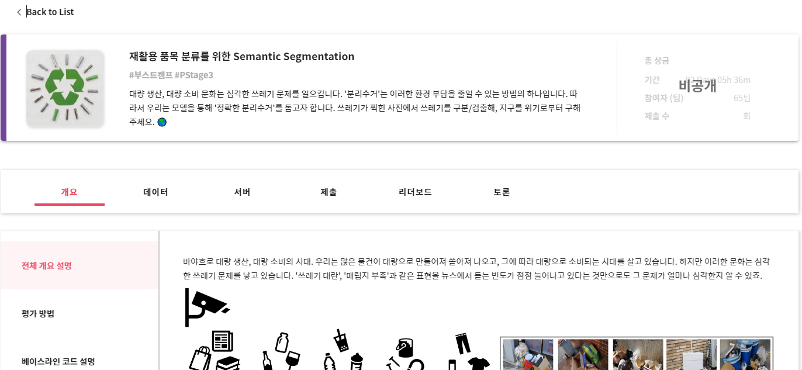
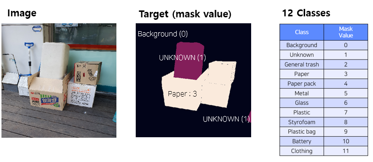
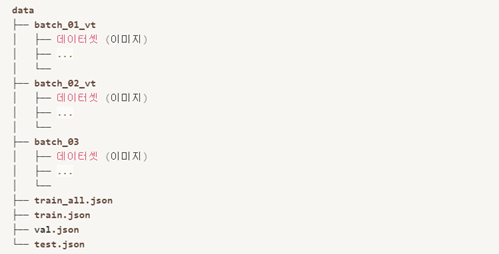
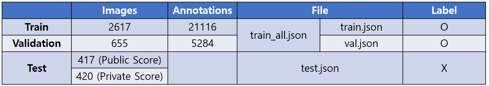
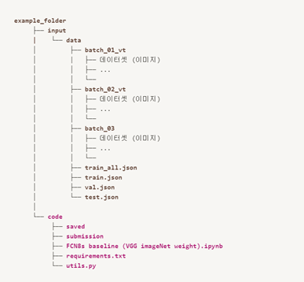

# ai tech boostcamp
# P-stage 3-1 (object segmentation)
## 재활용 품목 분류를 위한 Semantic Segmentation



바야흐로 대량 생산, 대량 소비의 시대. 우리는 많은 물건이 대량으로 만들어져 쏟아져 나오고, 그에 따라 대량으로 소비되는 시대를 살고 있습니다. 하지만 이러한 문화는 심각한 쓰레기 문제를 낳고 있습니다. '쓰레기 대란', '매립지 부족'과 같은 표현을 뉴스에서 듣는 빈도가 점점 늘어나고 있다는 것만으로도 그 문제가 얼마나 심각한지 알 수 있죠.


이러한 환경 부담을 조금이나마 줄일 수 있는 방법의 하나로 '분리수거'가 있습니다. 잘 분리배출 된 쓰레기는 자원으로서 가치를 인정받아 재활용되지만, 잘못 분리배출 되면 그대로 폐기물로 분류되어 매립, 소각되기 때문입니다. 우리나라의 분리 수거율은 굉장히 높은 것으로 알려져 있고, 또 최근 이러한 쓰레기 문제가 주목받으며 더욱 많은 사람이 분리수거에 동참하려 하고 있습니다. 하지만 '이 쓰레기가 어디에 속하는지', '어떤 것들을 분리해서 버리는 것이 맞는지' 등 정확한 분리수거 방법을 알기 어렵다는 문제점이 있습니다.

따라서, 우리는 쓰레기가 찍힌 사진에서 쓰레기를 Segmentation 하는 모델을 만들어 이러한 문제점을 해결해보고자 합니다. 문제 해결을 위한 데이터셋으로는 일반 쓰레기, 플라스틱, 종이, 유리 등 11 종류의 쓰레기가 찍힌 사진 데이터셋이 제공됩니다.

여러분에 의해 만들어진 우수한 성능의 모델은 쓰레기장에 설치되어 올바른 분리수거를 돕거나, 어린아이들의 분리수거 교육 등에 사용될 수 있을 것입니다. 성능을 올려 지구를 위기로부터 구해주세요! 🌎

## 학습데이터 개요
우리는 수많은 쓰레기를 배출하면서 지구의 환경파괴, 야생동물의 생계 위협 등 여러 문제를 겪고 있습니다. 이러한 문제는 쓰레기를 줍는 드론, 쓰레기 배출 방지 비디오 감시, 인간의 쓰레기 분류를 돕는 AR 기술과 같은 여러 기술을 통해서 조금이나마 개선이 가능합니다.

제공되는 이 데이터셋은 위의 기술을 뒷받침하는 쓰레기를 판별하는 모델을 학습할 수 있게 해줍니다.

### 데이터셋의 간략한 통계

* 전체 이미지 개수 : 4109장

* 12 class : Background, UNKNOWN, General trash, Paper, Paper pack, Metal, Glass, Plastic, Styrofoam, Plastic bag, Battery, Clothing

    * 참고 : train_all.json/train.json/val.json에는 background에 대한 annotation이 존재하지 않으므로 background (0) class 추가 (baseline 참고)

* 이미지 크기 : (512, 512)

###예제) image, target 시각화 및 pixel 별로 예측해야할 12개의 classes


### annotation file

annotation file은 coco format 으로 이루어져 있습니다.

coco format은 크게 2가지 (images, annotations)의 정보를 가지고 있습니다.

* images:

    * id: 파일 안에서 image 고유 id, ex) 1

    * height: 512

    * width: 512

    * filename: ex) batch01_vt/002.jpg

* annotations: (참고 : "bbox", "area"는 Segmentation 경진대회에서 활용하지 않습니다.)

    * id: 파일 안에 annotation 고유 id, ex) 1

    * segmentation: masking 되어 있는 고유의 좌표

    * bbox: 객체가 존재하는 박스의 좌표 (xmin, ymin, w, h)

    * area: 객체가 존재하는 영역의 크기

    * category_id: 객체가 해당하는 class의 id

    * image_id: annotation이 표시된 이미지 고유 id

### Segmentation competition에서 사용되는 데이터의 전체 구성


### 공개 데이터

* batch_01_vt / batch_02_vt / batch_03 → train / validation / test set 들의 이미지들이 섞여서 존재

* tarin_all.json / train.json / val.json / test.json → 아래 표 참고

즉, 전체 데이터의 80%에 해당되는 이미지는 학습하는데 활용이 되며, 20%는 test dataset 입니다.

teste dataset은 최종적 리더보드 점수에 활용이 되며, 이 중 50%는 public 리더보드 점수에 활용이 됩니다.

제공된 데이터 외의 외부 데이터를 활용하는 것은 금지됩니다. Test 데이터를 학습에 활용하시는 것은 가능합니다.

### 베이스라인 코드 설명
Segmentation competition의 첫번째 베이스라인의 코드는 VGG를 imagenet data set으로 미리 학습된 weight를 사용하여 구성된 FCN8s model을 바탕으로 작성 되었습니다.

### Components

* ``code/saved``

    * 설명 : ``FCN8s baseline (VGG imageNet weight).ipynb`` 에서 학습된 model (fcn8s_best_model(pretrained).pt)이 저장되는 폴더입니다.

* `code/submission/samplesubmission.csv`

    * 설명 : `code/submission` 는 학습된 model로부터 test set에 대한 예측된 값이 `submission.csv` 로 저장되는 폴더입니다.

    * `sample_submission.csv`는 `submission.csv` 을 생성하기 위해 참고하는 파일

* `code/FCN8s baseline (VGG imageNet weight).ipynb`

    * 설명 : baseline을 notebook 기반으로 작성하였으며, 순차적으로 실행하시면 `submission.csv` 을 생성할 수 있습니다.

* code/utils.py

    * 설명 : 평가지표인 mIoU를 계산하는 python script 입니다.

* code/requirements.txt

    * 설명 : baseline을 돌리기 위해 필요한 library 들이 기입되어 있습니다.

### How to use?

1. 데이터셋 다운로드

    * data 구성

      

2. 라이브러리 설치

    * 아래의 경로를 확인하여 `code.zip` 압축을 푼 후 `code`폴더를 아래와 같은 위치에 구성해주세요


    * code로 들어가서 아래 명령어를 실행해 필요한 라이브러리를 설치해 줍니다.

    ```
    pip install -r requirements.txt
    ```

3. `code/FCN8s baseline (VGG imageNet weight).ipynb` 실행

    1. 하이퍼파라미터 세팅 및 seed 고정

    2. 학습 데이터 EDA

    3. 데이터 전처리 함수 정의 (Dataset)

    4. Dataset 정의 및 DataLoader 할당

        1. 데이터 샘플 시각화 (Show example image and mask)

    5. baseline model

        1.   FCN8s (VGG imageNet weight)

    6. train, validation, test 함수 정의

    7. 모델 저장 함수 정의

    8. 모델 생성 및 Loss function, Optimizer 정의

    9. 저장된 model 불러오기 (학습된 이후)

    10. submission을 위한 test 함수 정의

    11. submission.csv 생성

4. `code/submission/submission.csv` 제출

## 렙업 레포트
  
  
  
  

